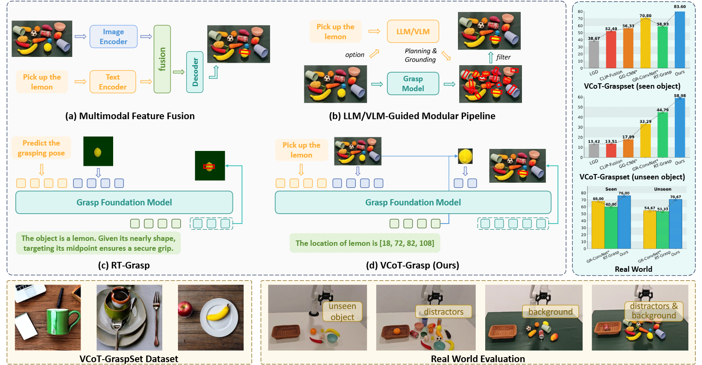

# VCoT-Grasp: Grasp Foundation Models with Visual Chain-of-Thought Reasoning for Language-driven Grasp Generation


<!-- [](https://arxiv.org/abs/2409.14163) -->


Authors: Haoran Zhang, [Shuanghao Bai](https://baishuanghao.github.io/), [Wanqi Zhou](https://scholar.google.com/citations?user=3Q_3PR8AAAAJ&hl=zh-CN), Yuedi Zhang, Qi Zhang, [Pengxiang Ding](https://scholar.google.com/citations?user=QyBSTzEAAAAJ), [Cheng Chi](https://scholar.google.com/citations?user=wWGpskcAAAAJ), [Donglin Wang](https://scholar.google.com/citations?user=-fo6wdwAAAAJ), [Badong Chen](https://scholar.google.com/citations?user=mq6tPX4AAAAJ&hl=zh-CN&oi=ao).


## Highlights


> **<p align="justify"> Abstract:** *Robotic grasping is one of the most fundamental tasks in robotic manipulation, and grasp detection/generation has long been the subject of extensive research. Recently, language-driven grasp generation has emerged as a promising direction due to its practical interaction capabilities. However, most existing approaches either lack sufficient reasoning and generalization capabilities or depend on complex modular pipelines. Moreover, current grasp foundation models tend to overemphasize dialog and object semantics, resulting in inferior performance and restriction to single-object grasping.
To maintain strong reasoning ability and generalization in cluttered environments, we propose VCoT-Grasp, an end-to-end grasp foundation model that incorporates visual chain-of-thought reasoning to enhance visual understanding for grasp generation. VCoT-Grasp adopts a multi-turn processing paradigm that dynamically focuses on visual inputs while providing interpretable reasoning traces.
For training, we refine and introduce a large-scale dataset, VCoT-GraspSet, comprising 167K synthetic images with over 1.36M grasps, as well as 400+ real-world images with more than 1.2K grasps, annotated with intermediate bounding boxes. Extensive experiments on both VCoT-GraspSet and real robot demonstrate that our method significantly improves grasp success rates and generalizes effectively to unseen objects, backgrounds, and distractors. Our code and dataset will be made publicly available.* </p>

<details>
  
<summary>Main Contributions</summary>

1) We propose VCoT-Grasp, an end-to-end foundation model that combines language-driven grasp generation with visual chain-of-thought reasoning, improving visual understanding, grasp quality, and generalization.
2) We present VCoT-GraspSet, a refined grasping dataset comprising 167K synthetic images with over 1.36M grasps and 400+ real-world images with more than 1.2K grasps. Each sample includes an image, grasp annotations, and intermediate bounding boxes that serve as chain-of-thought context.
3) Extensive experiments on both VCoT-GraspSet and real-world scenarios demonstrate that VCoT-Grasp produces high-quality grasps and generalizes effectively to unseen objects, backgrounds, and distractors.
   
</details>


## Installation 
Our code is tested on Ubuntu 22.04 LTS with cuda version 12.1. Follow the below steps to create environment and install dependencies.

* Setup conda environment.
```bash
# Create conda environment
conda create -y -n grasp python=3.9
conda activate grasp

# Install torch, refer to https://pytorch.org/get-started/previous-versions/ if your cuda version is different
pip install torch==2.2.0 torchvision==0.17.0 torchaudio==2.2.0 --index-url https://download.pytorch.org/whl/cu121

# Install flash attention for training, adjust MAX_JOBS according to your RAM
pip install ninja
MAX_JOBS=4 pip install flash-attn --no-build-isolation
# Alternatively, it's recommended to download .whl file from https://github.com/Dao-AILab/flash-attention/releases and directly install the .whl file.
wget https://github.com/Dao-AILab/flash-attention/releases/download/v2.7.4.post1/flash_attn-2.7.4.post1+cu12torch2.2cxx11abiFALSE-cp39-cp39-linux_x86_64.whl
pip install flash_attn-2.7.4.post1+cu12torch2.2cxx11abiFALSE-cp39-cp39-linux_x86_64.whl
```

* Clone repository and install requirements.
```bash
# Clone repository
git clone https://github.com/zhanghr2001/VCoT-Grasp.git
cd VCoT-Grasp

# Install requirements, version details are described in the file
pip install -r requirements.txt
```

## Data Preparation
Download Grasp Anything data.

```bash
# download and unzip
bash data_prepare/grasp_anything/download.sh
```

Our VCoT-GraspSet are in [split/vcot folder](split/vcot). Also modify the path in constants.py to your folders.
<!-- Our filter algorithm can be found in data_prepare/yolo_world. -->


## Training and Evaluation
Scripts for training and evaluation are in [scripts folder](scripts/). Training configs can be found in [accelerate_configs](accelerate_configs/).

```bash
# training
bash scripts/train.sh

# evaluation
bash scripts/eval.sh
```


## Demo
Our checkpoint is released on [HuggingFace](https://huggingface.co/zhanghr2001/VCoT-Grasp/).
Run the following command to download the checkpoint and run demo.
```bash
huggingface-cli download zhanghr2001/VCoT-Grasp --local-dir checkpoints/vcot
python demo.py
```

## Citation
If our code is helpful to your research or projects, please consider citing:
```bibtex
@misc{zhang2025vcotgraspgraspfoundationmodels,
      title={VCoT-Grasp: Grasp Foundation Models with Visual Chain-of-Thought Reasoning for Language-driven Grasp Generation}, 
      author={Haoran Zhang and Shuanghao Bai and Wanqi Zhou and Yuedi Zhang and Qi Zhang and Pengxiang Ding and Cheng Chi and Donglin Wang and Badong Chen},
      year={2025},
      eprint={2510.05827},
      archivePrefix={arXiv},
      primaryClass={cs.RO},
      url={https://arxiv.org/abs/2510.05827}, 
}
```


## Acknowledgements

Our style of readme refers to [PDA](https://github.com/BaiShuanghao/Prompt-based-Distribution-Alignment). 